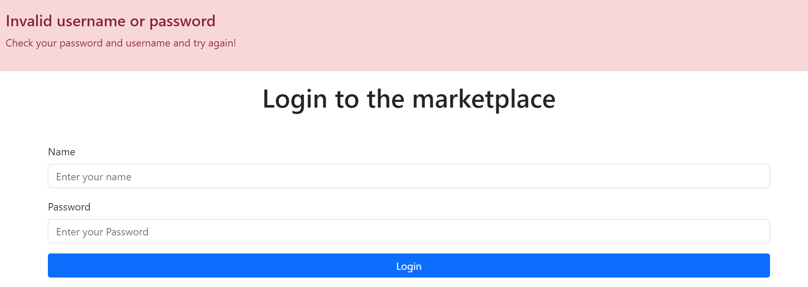
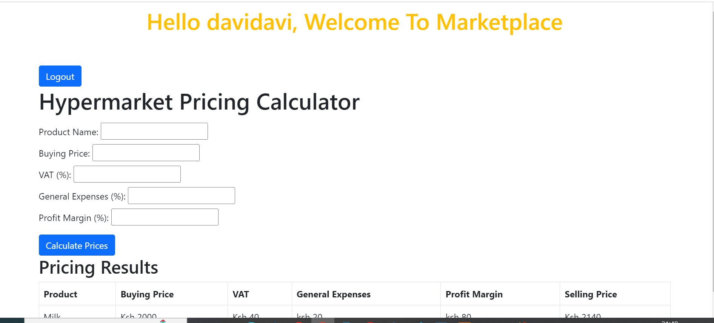

# MARKET PLACE CALCULATOR APP
- This is a simple app project that
- Allows user to register
- Allows user to log in
- Allows a user to calculate the selling price of a product

## To test this on your machine
- Ensure you have xampp server installed
- clone this in yout xampp- htdocs folder, start your xampp server
- navigate to your browers, type in the search bar localhost/'follow by the path of your files location'

## To start working on this project, Create a database with any name of your preference
-  create a table using this sql statement, copy and paste it in your 

Create database marketplace;
use marketplace;

CREATE table registration
(
id int auto_increment primary key,
username varchar(50),
password varchar(50)
);
- alter the table to allow unique user names only- i.e does not allow a username to be repeated
Alter table registration add unique(`username`);
## Open the connect.php file and append in required data to connect with your database

## Technologies used 
- PHP
- Bootstrap
- HTML
- MySQL workbench database

#### the signup page

- you cannot register using the same username you'll get an error message

#### Login page

- it ensures that only registered user can login using the right password ans uername
#### On successful login

- when you click logout on the marketplace page, youe are directed back to the loginpage.
